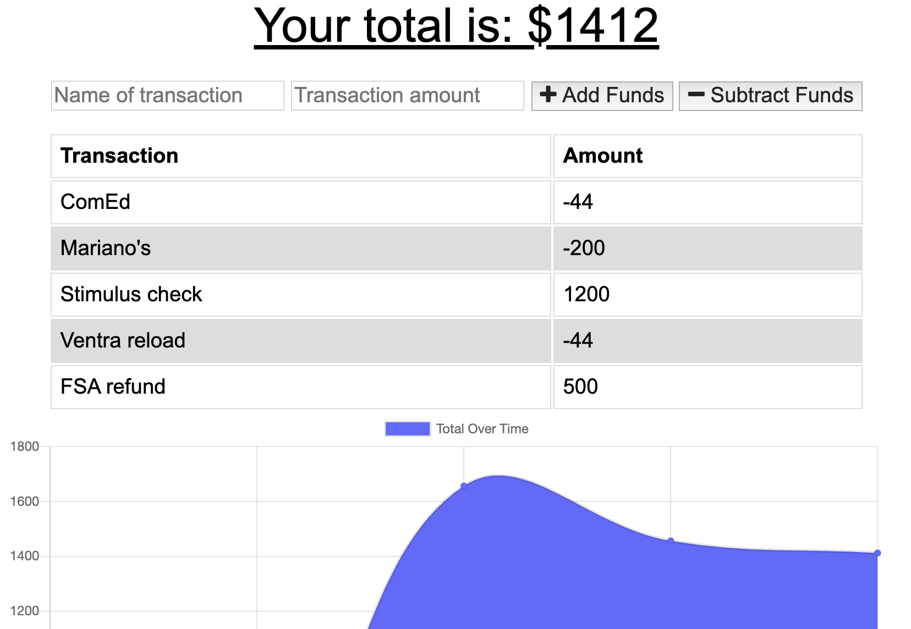

# Online/Offline Budget Tracker

This repository houses the files that implement a PWA budget tracker.

### Purpose

This application provides a means to record financial transactions. It is designed to work with or without an internet connection. If a user were to enter transactions while offline, the app would store those entries locally, then update an online database once the network connection were restored.

### Functionality

This application uses a service worker to maintain data and static file caches. It uses IndexedDB to record expenses and credits while offline.

### Concepts and techniques
* IndexedDB
* manifest.webmanifest
* mLab MongoDB add-on
* PWA
* service workers

https://github.com/davidcbalsley/hw13-budget-tracker

https://radiant-beyond-08581.herokuapp.com/
